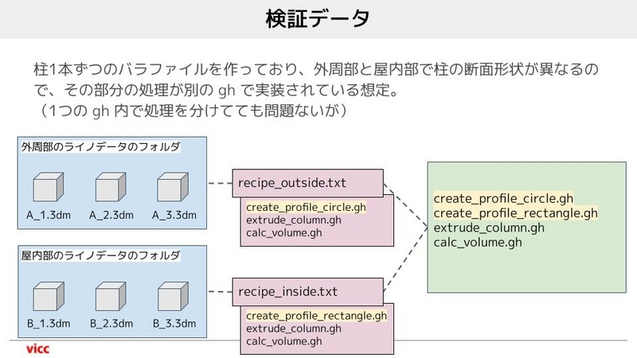
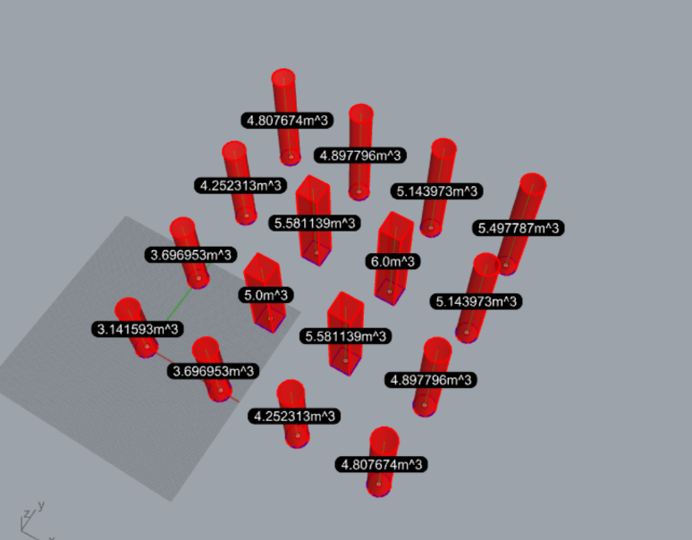

# MULTIPLE_GHs_WITH_RECIPE  

Author  
Naoki Yoshioka / naoki.yoshioka (at) vicc.jp  

複数のGrasshopperファイルの実行順を制御し連続的に実行する方法（vicc blog）  
[https://blog.vicc.jp/entry/how-to-run-multiple-ghs-with-recipe](https://blog.vicc.jp/entry/how-to-run-multiple-ghs-with-recipe)  

  
  

